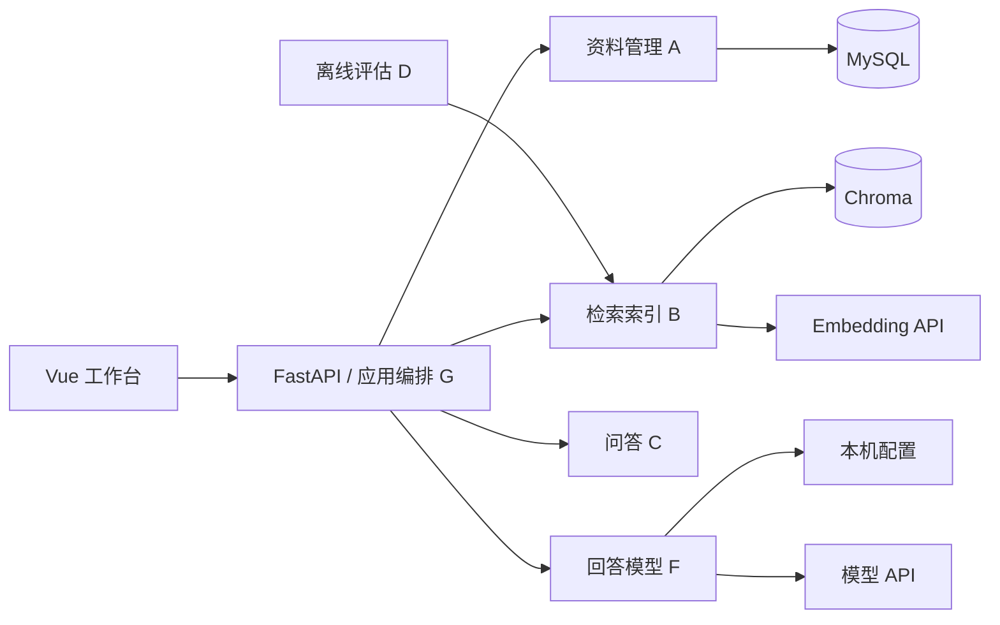

# EasyRAG

个人知识库问答系统：收录 Markdown / TXT，管理和编辑资料，基于知识库回答并展示出处与检索过程。资料更新、重索引或删除后，问答使用当前内容；依据不足时明确拒答。Vue 工作台支持在网页配置 OpenAI 兼容接口、DeepSeek 或本地 Ollama 回答模型。

## 架构

后端统一为一个 FastAPI 进程（8080），前端保持 Vue 3 + TypeScript + Pinia + Vite（5173）。MySQL 8 保存资料与切片，Chroma 保存可重建的派生向量。无需 Java 或独立的内部 RAG HTTP 服务。



A/B/C/F 互不引用。G 只调用各模块的 `public.py`，通过注入接口组合问答和索引流程。各模块独立维护类型、异常、数据与测试；模块边界由 AST 测试检查。

- 收录：A 保存 PENDING → 单线程任务调用 B 切片 → A 保存切片及 ID → B 建索引 → A 确认 INDEXED。
- 问答：查询许可 → F 固定一个模型会话 → C 通过注入端口检索、判定、生成 → A 补全出处，按最终检索 rank 展示。
- 更新/删除：变更许可覆盖撤旧向量和数据库变更，直到异步索引终态；无法确认一致时关闭问答，要求显式恢复。

完整边界、设计取舍与迁移记录见 [模块设计](docs/fastapi-modules.md)、[架构设计](docs/架构设计.md)。基线仍为向量检索和一次检索后的三态判定；BM25、查询改写重查、URL 抓取属于后续范围。

## 目录

```text
frontend/                       Vue 资料库 / 知识问答工作台
rag-service/app/http.py          HTTP 参数、响应与错误适配
rag-service/app/application/     装配、业务编排、运行门禁、单执行器、恢复
rag-service/app/modules/
  knowledge/                    MySQL、迁移、正文/哈希、切片与资料状态
  retrieval/                    切片、tokenizer、embedding、Chroma
  qa/                           判定、生成、拒答、trace，注入检索和模型端口
  answer_models/                配置、凭据、厂商 SDK、单问题会话
rag-service/app/maintenance.py   独占维护 CLI
rag-service/scripts/            离线检索评估
rag-service/tests/              模块、应用、HTTP、隔离 MySQL 集成测试
docs/                           设计、Issue 底稿、黄金集与评估报告
sample-knowledge/               29 篇样例语料
```

## 本地启动

需要 Python 3.14、MySQL 8.0、Node.js 24；默认 embedding 使用本地 Ollama 的 `bge-m3`。也可配置兼容的远程 embedding API。

先通过 MySQL 客户端创建数据库：

```sql
CREATE DATABASE easyrag CHARACTER SET utf8mb4 COLLATE utf8mb4_unicode_ci;
```

在 PowerShell 中准备后端：

```powershell
cd rag-service
python -m venv .venv
.\.venv\Scripts\python.exe -m pip install -r requirements.txt
Copy-Item .env.example .env
```

在 `.env` 填入 `MYSQL_HOST`、`MYSQL_PORT`、`MYSQL_DATABASE`、`MYSQL_USER`、`MYSQL_PASSWORD`。配置不入库。Linux/macOS 使用 `.venv/bin/python` 和 `cp .env.example .env`；下列 Python 命令对应替换即可。

首次空库初始化：

```powershell
.\.venv\Scripts\python.exe -m app.maintenance init-db
```

已有 Java/Flyway V2 数据库使用 `adopt-legacy-db`，不要对旧库运行初始化或删除表。该命令校验历史校验和、字段、索引及外键后登记 Alembic 基线，见 [切换与回退](docs/fastapi-cutover.md)。

准备默认检索模型与固定版本的 tokenizer：

```powershell
ollama pull bge-m3
New-Item -ItemType Directory -Force data/tokenizers | Out-Null
curl.exe -L -o data/tokenizers/bge-m3-5617a9f61b028005a4858fdac845db406aefb181.json https://huggingface.co/BAAI/bge-m3/resolve/5617a9f61b028005a4858fdac845db406aefb181/tokenizer.json
.\.venv\Scripts\python.exe -m app
```

只运行一个后端进程和一个 worker。后端与维护命令共用 `RUNTIME_LOCK_FILE`，同一套数据必须使用同一个锁路径；不要为多实例配置不同锁。启动后先访问 `http://127.0.0.1:8080/health`：进程始终单独报告 UP，数据库、Chroma、embedding 和 tokenizer 分层报告依赖状态。资料浏览与模型配置不依赖模型服务成功。

在另一终端启动前端：

```powershell
cd frontend
npm ci
npm run dev -- --host 127.0.0.1 --port 5173
```

打开 `http://127.0.0.1:5173/`，点击「确认就绪」。后端启动时是 `RECOVERY_REQUIRED`；只有资料/切片/向量完整一致才开放问答，并重新提交 PENDING。程序不会自动替用户确认恢复。前端继续代理 `/api` 与 `/health` 到 8080，页面和交互说明见 [前端 README](frontend/README.md)。

## 回答模型

网页「知识问答 → 模型 → 配置回答模型」可保存服务类型、接口地址、模型名与 API Key。配置保存在忽略入库的 `rag-service/config/llm.json`，或 `LLM_CONFIG_FILE` 指定路径。密钥不回传，留空仅在接口地址和服务类型不变时沿用。

每个问题固定一个会话；配置修改从下一次问题生效，切换回答模型不重建向量。「恢复启动配置」移除本机覆盖文件，重新读取环境变量 / `.env`。启动配置使用 `LLM_PROVIDER`、`LLM_MODEL`、`LLM_BASE_URL`、`LLM_API_KEY`、`LLM_TIMEOUT_SECONDS`，示例见 [.env.example](rag-service/.env.example)。

## 维护与故障恢复

停止后端后，在同一目录、同一配置下执行：

```powershell
.\.venv\Scripts\python.exe -m app.maintenance adopt-legacy-db
.\.venv\Scripts\python.exe -m app.maintenance rebuild-index
```

接管只用于支持的旧库；重建用于缺失/多余/过时向量、遗留 INDEXING 或切片/embedding 配置改变。重建保留能证明与当前正文和切片参数完全匹配的 ID，否则重新切片。失败返回非零退出码，重新启动也不会自动放行。没有公开 `/reset`、`/embed`、`/chunk` 等内部操作接口。

[API 文档](docs/api.md) 说明参数、状态码和响应字段；在线路由与请求结构位于 `http://127.0.0.1:8080/docs`。

## 验证

```powershell
cd rag-service
.\.venv\Scripts\python.exe -m pytest -q
# 需要可创建/删除测试库的 MySQL 用户；环境变量 MYSQL_* 指向本机测试服务器。
.\.venv\Scripts\python.exe -m pytest tests/mysql_schema_integration.py tests/mysql_knowledge_integration.py tests/mysql_recovery_integration.py tests/mysql_rebuild_integration.py tests/mysql_http_integration.py -q
```

集成测试只创建并删除 `easyrag_fastapi_it_<随机UUID>`，不选择业务数据库；使用临时 Chroma、tokenizer 和本地 HTTP 模型服务，不需要真实模型或付费请求。数据库初始化、旧库接管、事务、UTF-8 偏移、索引恢复、HTTP 与维护子进程均有覆盖。CI 在 Linux 上运行同一批测试，并保留 Vue 测试与构建。

```powershell
cd frontend
npm test
npm run build
npm run test:browser
npm run test:browser:models
```

浏览器测试需要前端预览服务和本机 Chrome。`node tests/browser-live.mjs` 会调用当前真实模型，只创建并清理自己命名的临时资料；详见前端 README。

离线评估入口：`python scripts/eval_retrieval.py --help`。黄金集和既有基线见 [评估基线](docs/eval/retrieval-baseline-v1.md)。本次架构迁移未改检索算法，未重新宣称新的检索指标。
