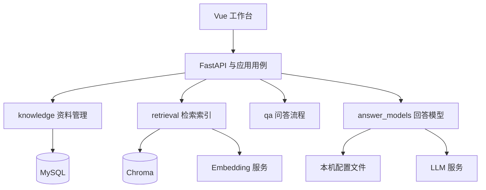

# FastAPI 模块迁移设计与实施记录

2026-09-15。用户已确认：单 FastAPI 进程、独立业务模块与应用编排、短暂停用后切换。本文是当前架构的实施依据；旧 Java 阶段记录保留作为历史证据。

## 目标与约束

保留 Vue 工作台、现有 HTTP 契约、MySQL 资料与切片、模型配置及向量检索行为。统一后端监听 8080，开发目录继续使用 `rag-service/`。不新增检索算法或产品能力。

四个业务模块互不 import。应用模块通过其 `public` 入口组合功能，不访问私有存储或 SDK。各模块维护自己的类型、错误和测试；接口适配只转换数据与错误。



## 模块归属

| 模块 | 私有资源和规则 | 公开能力 |
|---|---|---|
| A knowledge | document/chunk、SQLAlchemy、Alembic、正文解析、哈希、状态机、短事务 | 收录/查询/更新/软删、切片保存与索引终态、出处 |
| B retrieval | 切片、tokenizer、embedding、Chroma、索引清理 | split、replace、delete_document、search、inspect、reset、health |
| C qa | 提示词、判定、生成、拒答、引用编号、trace | answer(question, search, chat) |
| F answer_models | 配置文件、凭据、地址解析、厂商 SDK | get/save/reset/open_session |
| G application | HTTP 适配、装配、跨模块用例、门禁、单执行者、维护 CLI | 现有 REST、就绪、数据库接管与重建 |
| D evaluation | 黄金集、离线脚本、指标、报告 | 原有离线评估命令；仅使用公开切片入口 |
| E frontend | 页面、交互、临时状态 | 调用 G 的 HTTP API |

A/B/C/F 不依赖其他业务模块、应用模块、FastAPI 或应用全局状态。G 只能导入业务模块的 public 入口。CLI 和离线评估是外部消费者。类型使用独立数据快照，禁止跨边界传递数据库连接、ORM、IndexStore、Chroma collection、FastAPI Request 或厂商 SDK 客户端。

## 公开接口原型

```python
# A 的数据由 A 定义，SQL 和状态转换仅在 A 内部实现。
Document = {id, source_type, source_uri, title, content, content_hash,
            tags, index_status, index_error, created_at, updated_at}
StoredChunk = {id, document_id, seq, text, byte_start, byte_end,
               heading_path, token_count}
Knowledge.create(filename, content_bytes) -> Document
Knowledge.list(page, size, status, q) -> {total, items}
Knowledge.get(document_id) -> Document
Knowledge.chunks(document_id) -> tuple[StoredChunk]
Knowledge.update(document_id, content) -> {document, changed}
Knowledge.prepare_reindex(document_id) -> Document
Knowledge.delete(document_id) -> None
Knowledge.begin_indexing(document_id, chunks) -> tuple[StoredChunk]
Knowledge.mark_indexed(document_id) -> None
Knowledge.mark_failed(document_id, error) -> None
Knowledge.pending_ids() -> tuple[int]
Knowledge.sources(chunk_ids) -> tuple[Source]
DocumentSnapshot = {document, chunks, chunks_valid}
Knowledge.snapshots() -> tuple[DocumentSnapshot]
Knowledge.begin_rebuild(document_id, chunks, *, expected_content) -> tuple[StoredChunk]
Knowledge.initialize_database() -> None
Knowledge.adopt_legacy_database() -> None

# B 不知道 SQL 或文档业务状态；所有索引对象留在模块内。
ChunkDraft = {text, byte_start, byte_end, heading_path, token_count}
IndexChunk = {chunk_id, text, heading_path, tags}
SearchHit = {chunk_id, document_id, text, heading_path, score}
IndexEntry = {chunk_id, document_id, seq, text, heading_path, tags}
Retrieval.split(content, title) -> tuple[ChunkDraft]
Retrieval.replace(document_id, chunks) -> int
Retrieval.delete_document(document_id) -> int
Retrieval.search(query, top_k=5) -> tuple[SearchHit]
Retrieval.inspect() -> tuple[IndexEntry]
Retrieval.reset() -> None
Retrieval.runtime_info() -> {status, embedding, chroma}
Retrieval.health() -> {status, embedding, chroma, tokenizer}
Retrieval.close() -> None

# C 自己定义需要的能力，由 G 适配实现。
Evidence = {chunk_id, document_id, text, heading_path, score}
SearchPort.search(query, top_k) -> tuple[Evidence]
ChatPort.complete(prompt) -> str
AnswerDraft = {answer, status, chunk_ids, trace}
Qa.answer(question, search, chat, top_k=5) -> AnswerDraft

# F 只返回公开配置或封装后的会话，密钥和 SDK 不出模块。
Models.get() -> PublicConfig
Models.save(update) -> PublicConfig
Models.reset() -> PublicConfig
Models.open_session() -> ChatSession
ChatSession.complete(prompt) -> str
```

## 用户故事与一致性

- 收录：G 调 A 保存 PENDING 并立即返回 201；后台调用 B 切片 → A 保存 chunks 并进入 INDEXING → B 替换索引 → A 确认 INDEXED。
- 编辑/重建：G 在撤旧索引前取得独占许可，B 撤旧 → A 提交新正文或重建状态 → 后台索引。许可移交任务并持续至终态。相同哈希只更新时间，保留原文、元数据和切片。
- 删除：G 独占许可 → B 删除索引 → A 软删并清切片。未确认删除或数据库终态则进入 RECOVERY_REQUIRED。
- 问答：G 查询许可 → F 创建配置快照会话 → C 通过注入接口检索、判定、生成 → A 补出处。使用最终 trace 的 rank 对应 chunk ID，所有步骤结束才释放查询许可。
- 模型配置：G 路由直接调用 F；更换回答模型不重建向量。同一问题的判定与生成使用同一会话。

多个查询共享许可，索引变更独占许可。状态转换用短锁，业务许可可以跨线程移交，不能持有实际线程锁跨线程。后台执行器为单线程；遇忙保持 PENDING，由手动 ready 重提，不阻塞等待 READY。客户端断开不能结束仍在运行的工作。所有同步 HTTP 工作都在实际线程内登记；停机先停止接收工作，等待 HTTP 线程、索引执行器和许可全部结束，再关闭 B/A 资源，最后释放进程锁。

模型失败不阻断资料浏览和配置。Chroma 失败时资料浏览/收录仍可用，新资料停在 PENDING。A 只处理自己的数据库异常；B 维护自身部分索引清理；G 根据公开结果决定跨模块恢复状态。

## 兼容与恢复

- 保留所有现有公开 HTTP 字段、状态码与错误结构 `{error, state?}`；参数错误为 400，重索引 202，删除 204 空正文；健康检查 200，依赖状态分层报告。
- 保留零基分页、20 默认/100 上限、标题字面量搜索、1 MiB UTF-8 正文、BOM 与元数据解析、Java 哈希空白语义。物理 char_start/char_end 继续存 UTF-8 字节偏移。
- A 使用 SQLAlchemy Core + PyMySQL。Alembic 空库建立现有 V2 等价结构；旧库显式校验 Flyway V2 和 schema 后登记基线。不得无条件 create_all、重建业务表或盲目 stamp。保留 MYSQL_* 环境变量及历史迁移证据。
- G 启动 RECOVERY_REQUIRED。ready 在恢复许可内检查 A 的资料/切片与 B 的向量 ID、归属、正文和元数据；不能只比较数量。一致后先开放，再扫描 PENDING，recovered 表示重新提交的数量。
- 不一致时停服运行 `python -m app.maintenance rebuild-index`。维护由 G 编排 A/B 公开能力，全量清理派生索引；证明与原文和切片配置一致的 chunks 保留 ID，否则重切。失败不得报告恢复成功。
- 原服务退出、业务停止写入后备份 MySQL、Chroma、配置，再接管数据库和切换 8080。新后端验收通过后开放用户写入；失败成套恢复。

## Issue 与 PR 检查点

总 Issue [#1](https://github.com/vansye/EasyRAG/issues/1) 已更新模块和用户故事；A #2、B #3、C #27、D #37、E #33、F #35、G #36 均已挂为真实子 Issue。E 的 PR #34 保持独立；#15 保留为 A 的历史增量。

每个模块 Issue 包含功能、数据原型、接口原型、所有权、失败语义、依赖、验收、PR 清单。每个功能一个 PR，关联模块 Issue；全部验收完成前使用 Refs 而非提前关闭整个模块。

- [x] 文档与模块 Issue：所有状态、数据、异常有明确负责人。
- [x] G 骨架：公开接口与 import 约束测试。
- [x] A 数据接管：真实 MySQL 验证空库/旧库、约束、ID 与事务。
- [x] A 资料与状态：迁移输入、CRUD、切片、状态与出处规则。
- [x] B 检索索引：保留算法，模块独立验证向量和失败清理。
- [x] F 回答模型：配置与 HTTP 分离、密钥/会话边界。
- [x] C 问答：检索/模型端口注入，保留三态回答与 trace。
- [x] G 收录索引、更新删除、问答引用：分别接线、测试、PR。
- [x] G 恢复与维护：竞态、异常退出、缺失/多余/过时索引验证。
- [x] D/E 回归：评估流程、前端构建及真实浏览器验收。
- [x] CI、启动文档、旧 Java 退出和切换备份。

每批最多编辑 3 个文件，报告文件、目的、受影响边界和验证结果。迁移 PR 顺序叠加在 #34 的代码之后，不自动合并。

已发布的功能 PR：

| 范围 | PR |
|---|---|
| 设计与依赖边界 | [#38](https://github.com/vansye/EasyRAG/pull/38)、[#39](https://github.com/vansye/EasyRAG/pull/39) |
| A 输入、数据库接管、CRUD、恢复快照 | [#40](https://github.com/vansye/EasyRAG/pull/40)、[#42](https://github.com/vansye/EasyRAG/pull/42)、[#43](https://github.com/vansye/EasyRAG/pull/43)、[#49](https://github.com/vansye/EasyRAG/pull/49) |
| B 独立模块与保留回归 | [#41](https://github.com/vansye/EasyRAG/pull/41)、[#48](https://github.com/vansye/EasyRAG/pull/48) |
| F 配置与会话 / C 问答 / D 评估 | [#44](https://github.com/vansye/EasyRAG/pull/44)、[#46](https://github.com/vansye/EasyRAG/pull/46)、[#47](https://github.com/vansye/EasyRAG/pull/47) |
| G 索引、变更、恢复、问答、HTTP | [#45](https://github.com/vansye/EasyRAG/pull/45)、[#50](https://github.com/vansye/EasyRAG/pull/50)、[#51](https://github.com/vansye/EasyRAG/pull/51)、[#52](https://github.com/vansye/EasyRAG/pull/52)、[#53](https://github.com/vansye/EasyRAG/pull/53) |
| 真实索引恢复与维护全链路 | [#54](https://github.com/vansye/EasyRAG/pull/54)、[#55](https://github.com/vansye/EasyRAG/pull/55) |
| 统一运行入口、CI、旧实现退出与本机切换 | [#56](https://github.com/vansye/EasyRAG/pull/56) |

2026-09-15 已完成本机切换：新就绪审计拦截旧索引缺失，离线重建后 623 个切片 ID 全部保留，13 份原资料与真实浏览器流程验收通过。完整执行结果、配置归属和备份证据见 [切换与回退](fastapi-cutover.md)。所有 PR 保持待审查，未自动合并；URL 收录、检索改写和评估界面仍属后续规划。
